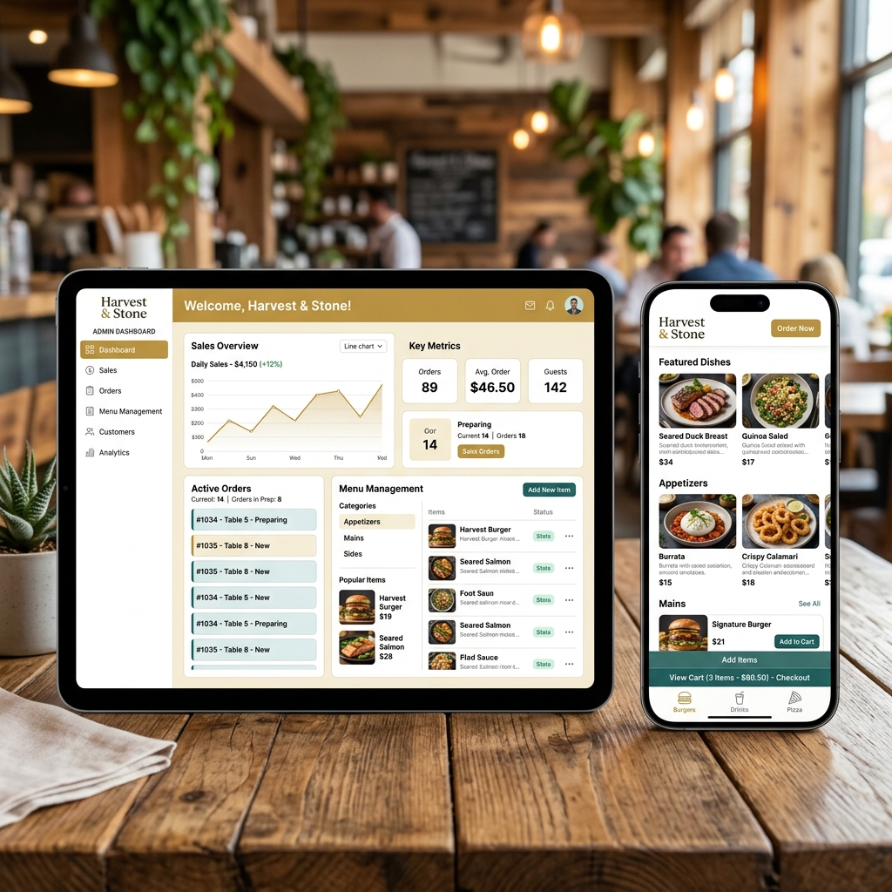

# TableTap

  

Welcome to **TableTap**, the modern digital menu and ordering platform built for restaurants.

### 🔗 Live Application
**[tabletap.pratikdhimal.com.np](https://tabletap.pratikdhimal.com.np)**

---

## 🍽️ What is TableTap?

TableTap is a comprehensive digital solution designed to streamline the dining experience for both restaurant customers and staff. It replaces traditional paper menus with interactive digital interfaces, empowering guests to browse, order, and pay directly from their smartphones, while providing restaurant management with a robust dashboard to track operations.

## ✨ Key Features

### For the Customer
* **Scan & Order:** Guests can instantly access the restaurant's menu by simply scanning a QR code at their table—no app download required.
* **Interactive Digital Menu:** A sleek, user-friendly interface that showcases dishes, categories, and prices.
* **Order Tracking:** Guests can review their order history and current active orders in real-time.

### For Restaurant Management (Admin Panel)
* **Live Dashboard:** A real-time overview of the restaurant's pulse, including daily sales reports, active orders, and revenue metrics.
* **Menu Management:** Seamlessly add, update, or remove menu items to keep offerings up-to-date.
* **Order Processing & Billing:** Track incoming orders, manage table status, and generate bills with multiple payment statuses.
* **Restaurant Profile:** Manage essential business details, from contact information to location data.

## 🎯 Purpose

The primary goal of TableTap is to modernize the hospitality industry by minimizing wait times and reducing order friction. By providing an intuitive interface for both the front-of-house and back-of-house, TableTap ensures an efficient, seamless, and delightful dining experience.

---
*TableTap — Dine in, Delivered.*
